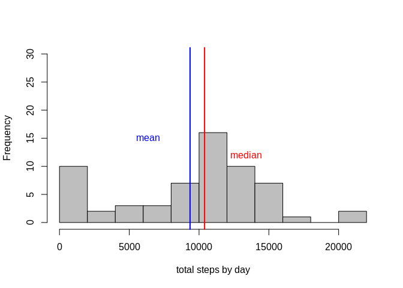
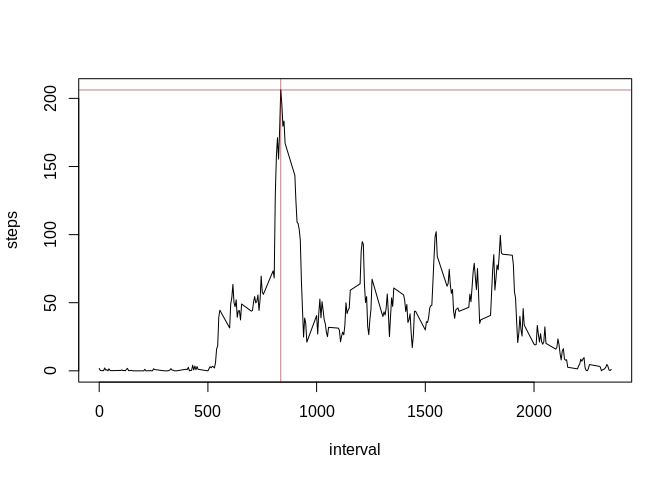
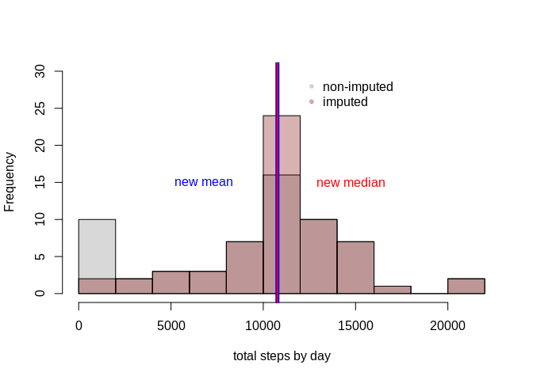
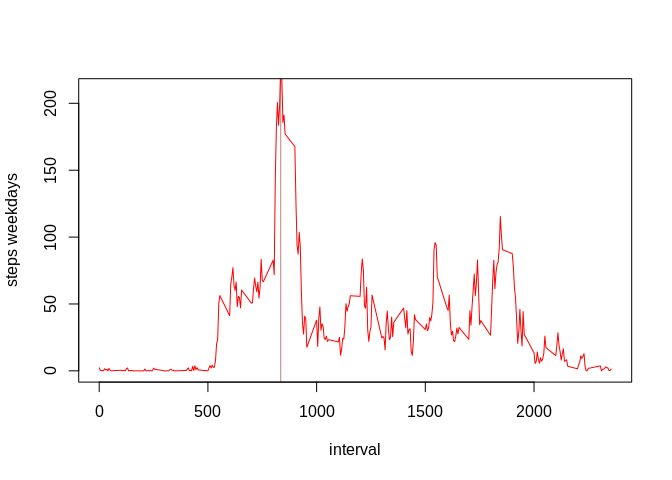
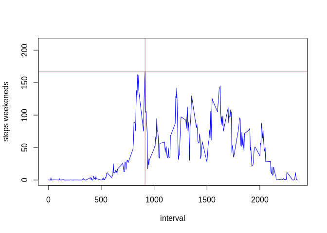

# Synopsis

Here we analyse data about personal movement collected by activity monitoring devices e.g. Fitbit, Nike Fuelband, or Jawbone Up. Activity data is collected at 5 minute intervals through out the day during October and November, 2012 and include the number of steps taken in 5 minute intervals each day. For more details <https://www.coursera.org/learn/reproducible-research/peer/gYyPt/course-project-1>.

## Loading and preprocessing the data

```r
# Uncomment to download the file

#library(formatR)
fileurl <- 'https://d396qusza40orc.cloudfront.net/repdata%2Fdata%2Factivity.zip'

if(!file.exists('activity.csv')) {
  download.file(fileurl, 'repdata_data_activity.zip', method='curl')
  unzip(zipfile='repdata_data_activity.zip')
  file.remove('repdata_data_activity.zip')
  DATA <- read.csv('activity.csv')
  } else {
  unzip(zipfile='activity.zip')
  DATA <- read.csv('activity.csv')
    }
```

# What is mean total number of steps taken per day?
The variables included in this dataset are 
steps, date, interval and there are a total of 
17568 observations in this dataset. 


```r
DATA$date<-as.factor(DATA$date)

total_steps<-by(DATA$steps, DATA$date, function(x){sum(x, na.rm = TRUE)} )

hist(total_steps, main='', breaks = 15, col = 'grey', xlab='total steps by day', ylim=c(0,30))
abline(v=mean(total_steps, na.rm=TRUE), col="blue", lwd=2)
abline(v=median(total_steps, na.rm=TRUE), col="red", lwd=2)
text(x=-3000+mean(total_steps, na.rm=TRUE), y = 15,"mean", col='blue')
text(x= 3000+median(total_steps, na.rm=TRUE), y = 12,"median", col='red')
```

<!-- -->

The mean is 9354, and the median is 1.04\times 10^{4}.

# What is the average daily activity pattern?

```r
DATA$interval<-as.factor(DATA$interval)
steps_5min<-by(DATA$steps, DATA$interval, function(x){mean(x, na.rm = TRUE)} )
se_5min<-by(DATA$steps, DATA$interval, function(x){sd(x, na.rm = TRUE)/sqrt(sum(!is.na(x)))} )

plot(x= as.numeric(as.matrix(unique(DATA$interval))), y= matrix(unlist(steps_5min)), type="l",
     ylab ="steps", xlab ="interval" )
#arrows(x0= as.numeric(as.matrix(unique(DATA$interval))) , y0=c(as.numeric(steps_5min-2*se_5min)), 
#       x1= as.numeric(as.matrix(unique(DATA$interval))), y1=as.numeric(steps_5min+2*se_5min), length=0.05, angle=90, code=3, col=rgb(0.1,0.1,0.1,0.5))
abline(h=max(steps_5min, na.rm=TRUE),  col=rgb(0.5,0,0,0.5))
abline(v=as.numeric(as.matrix(unique(DATA$interval)))[which(steps_5min==max(steps_5min, na.rm=TRUE))], col=rgb(0.5,0,0,0.5))
```

<!-- -->

## Imputing missing values
Replace each missing value with the mean value of its 5-minute interval. There are
2304 NAs in steps,
0 NAs in interval,
0 NAs in date. There are only Nas in steps.

## Impute the NA with the interval's mean. 


```r
IMPUTED_DATA <- DATA 

ave_interval<-aggregate(DATA$steps, list(DATA$interval), FUN=function(x){mean(x,na.rm=TRUE)})
colnames(ave_interval)<-c("interval","ave")
idx<- match( DATA$interval[is.na(DATA$steps)] , ave_interval$interval)
#sum( as.numeric(DATA$interval[is.na(DATA$steps)]) - as.numeric(ave_interval$interval[idx]) )

IMPUTED_DATA$steps[is.na(DATA$steps)]<- ave_interval$ave[idx] 
imputed_total_steps<-by(IMPUTED_DATA$steps, IMPUTED_DATA$date, function(x){sum(x, na.rm = TRUE)} )
```

```r
hist(total_steps, main='', breaks = 15, col = rgb(0.5,0.5,0.5,0.3), xlab='total steps by day' , ylim = c(0,30))
hist(imputed_total_steps, main='', breaks = 15, col = rgb(0.5,0,0,0.3),  add=TRUE)
legend(x=12000,y=30, 
       c("non-imputed", "imputed"), 
       pch=c(20, 20), 
       col=c(rgb(0.5,0.5,0.5,0.3),rgb(0.5,0,0,0.3)), 
       bty = "n")
abline(v = mean(imputed_total_steps, na.rm=TRUE), col="blue", lwd=5)
abline(v = median(imputed_total_steps, na.rm=TRUE), col="red", lwd=2)
text(x= -4000+ round(mean(imputed_total_steps, na.rm=TRUE)), y = 15,"new mean", col='blue')
text(x= 4000+ round(median(imputed_total_steps, na.rm=TRUE)), y = 15,"new median", col='red')
```

<!-- -->
The mean is 1.0766\times 10^{4}, and the median is 1.077\times 10^{4}.

# Differences between weekdays and weekends.
How many weekdays/ends are in the data?

```r
#class(IMPUTED_DATA$date) # change to format Date

IMPUTED_DATA$date <- as.Date(IMPUTED_DATA$date)
IMPUTED_DATA$day <- weekdays(as.Date(DATA$date))
#table(IMPUTED_DATA$day)

IMPUTED_DATA$day[IMPUTED_DATA$day =="zaterdag"]<-"weekend"
IMPUTED_DATA$day[IMPUTED_DATA$day=="zondag"]<-"weekend"

#table(IMPUTED_DATA$day)

IMPUTED_DATA$day[IMPUTED_DATA$day !="weekend"]<-"weekday"
IMPUTED_DATA$day<-as.factor(IMPUTED_DATA$day)
wend<-subset(IMPUTED_DATA, day=="weekend", select=c(steps, interval))
wday<-subset(IMPUTED_DATA, day=="weekday", select=c(steps, interval))

wend_steps_5min<-by(wend$steps, wend$interval, function(x){mean(x, na.rm = TRUE)} )
wdays_steps_5min<-by(wday$steps, wday$interval, function(x){mean(x, na.rm = TRUE)} )
```
Are there differences in activity patterns between weekdays and weekends?
Re-label the dates in weekdays and weekends (using subset)

```r
table(IMPUTED_DATA$day)
```

```

weekday weekend 
  12960    4608 
```

```r
#par(mfrow=c(2,1))
plot(x= as.numeric(as.matrix(unique(DATA$interval))), y= matrix(unlist(wdays_steps_5min)), type = "l", col='red', ylab='steps weekdays', xlab='interval' , ylim=c(0,210))
abline(h=max(wdays_steps_5min, na.rm=TRUE),  col=rgb(0.5,0,0,0.5))
abline(v=as.numeric(as.matrix(unique(DATA$interval)))[which(wdays_steps_5min==max(wdays_steps_5min, na.rm=TRUE))], col=rgb(0.5,0,0,0.5))
```

<!-- -->

```r
plot(x= as.numeric(as.matrix(unique(DATA$interval))), y= matrix(unlist(wend_steps_5min)), type = "l", col='blue', ylab='steps weekeneds', xlab='interval', ylim=c(0,210))
abline(h=max(wend_steps_5min, na.rm=TRUE),  col=rgb(0.5,0,0,0.5))
abline(v=as.numeric(as.matrix(unique(DATA$interval)))[which(wend_steps_5min==max(wend_steps_5min, na.rm=TRUE))], col=rgb(0.5,0,0,0.5))
```

<!-- -->

# Conclusions
We observe a similar spikes weekdays on 835, and weekends on to 915. After the maximum spike, the number of steps during weekdays are lower than on weekends. This is as expected during office hours.   
